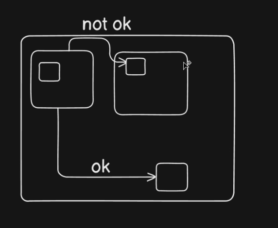

everything in parenthises is called function
there can be many function
class is like a factory that have samml unit that unit ares function
python programe can make of class , object , properties and function

object like a blueprint so we can make new code from them
when we creat a class we have to make `__init__` to create this

python is readable , productive , protable , stander libery , multi use

python have virtual enviourment mens a python downlode in your whole operating system but each and evry project have thir own mini python dependency so we can work many python version in a same time without any wory

so intall the virtual envoirment we need to go the the spsefic folder `python3 -m venv .venv` or `sudo apt install python3.13-venv`
we can name this `venv` anything but this is starnder and the . is for the folder hiden to acticate this in fish shell we need `. .venv/bin/activate.fish` and for normal terminal `.venv/bin/activate` and for deactivate just wirte `deactivate`

for install new dependency  using a pip like
make a file `requirements.txt` and write all the dependency + verison that we need

Alys work in vertual envourment everytime so its separate evrything

in python world whatever have .py file are called modules.
and the packages are called utils in this theere `__init.py__` are write. in the `__init.py__` are empty  



in python there a PEP8 that style the python code like the rule how to write the python code

objects are indeed real-world instances created from classes, much like a specific car that uses a car blueprint. This highlights the practical application of classes in programming, allowing you to create and manipulate specific instances that embody the characteristics defined by the class.

> Simple code that easy to understad alwyas better

>The Zen of Python, by Tim Peters
```
Beautiful is better than ugly.
Explicit is better than implicit.
Simple is better than complex.
Complex is better than complicated.
Flat is better than nested.
Sparse is better than dense.
Readability counts.
Special cases aren't special enough to break the rules.
Although practicality beats purity.
Errors should never pass silently.
Unless explicitly silenced.
In the face of ambiguity, refuse the temptation to guess.
There should be one-- and preferably only one --obvious way to do it.
Although that way may not be obvious at first unless you're Dutch.
Now is better than never.
Although never is often better than *right* now.
If the implementation is hard to explain, it's a bad idea.
If the implementation is easy to explain, it may be a good idea.
Namespaces are one honking great idea -- let's do more of those!
```