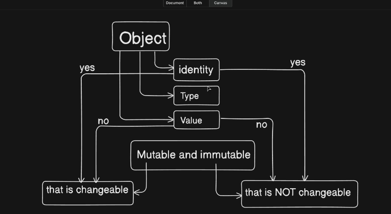

# Objects - Mutable and Immutable in Python

everything is a object
verey object has

1. identity
2. type
3. value

so in python see the object is _mutable or not_ is best way to see this by identity
if idenenty same its not mutable
if idenenty not change its mutable

never check the identy by value

# Object must have identity , type , value

sugar_ammount = 2
print(f"sugar amount in first: {sugar_ammount}")

sugar_ammount = 12
print(f"sugar amount in second: {sugar_ammount}")

# The variable sugar_ammount does not change the integer object;

# it simply points to a new reference (12 instead of 2).

# To confirm, we can compare their ids:

print(f"id of integer 2: {id(2)}") # e.g., 10746448
print(f"id of integer 12: {id(12)}") # e.g., 10746768

# number is inmutable in python

# The integer object 2 remains in memory, but the name refers

# to a different object after reassignment.

# A set is a collection of data and is mutable.

fruties = set()
print(f"initial fruties value: {fruties}")
print(f"id of fruties before change: {id(fruties)}")

fruties.add("banana")
fruties.add("apple")
print(f"fruties after additions: {fruties}")
print(f"id of fruties after change: {id(fruties)}")

# Unlike numbers, a set does not create a new object each time;

# it modifies the existing object in place, so its id remains the same.

# Thus, sets are mutable, while numbers are immutable.

# imutable mens we can not change its exsistence from memory like number we creat a number it will stay their but set we can chnage its value

# Numbers, Booleans and Operators in Depth in Python

there in python

- integers
- boolean
- Real floating/ decimal
- complex number 2+j3
  id() shows you the memory reference of the object currently being used.

If an integer hasn’t been used yet, Python will still create it when needed.

Reassigning a variable doesn’t mutate the integer; it just points the variable name to a new integer object.

Integers are immutable.

Even if you never explicitly use a number like 152, id(152) works because Python creates it on demand.

# Numbers, Booleans and Operators in Depth in Python

in python there are 4 types of number

1. Integer
2. Boolean
3. Real floating-> Decimal
4. complex Number (for scienties use only ) 2+5j

# String - Core, Indexing, Slicing, and Encoding

# Strings are immutable

coustomer_name = "antika"
coustomer_order = "aromatic bold tea"

# In Python, each character has an index starting from 0.

# Slicing uses [start:end:step], and the end index is exclusive.

print(f"The order of {coustomer_name} is {coustomer_order}")

# Full string from index 0 to end

print(f"Full string: {coustomer_order[0:]}")

# From beginning up to (but not including) index 17

print(f"Up to index 17: {coustomer_order[:17]}")

# Every 5th character from index 0

print(f"Every 5th char: {coustomer_order[0::5]}")

# Reverse the entire string

print(f"Reversed string: {coustomer_order[::-1]}")

# Encoding and decoding

lable = "Happy birthday 😇"
encode_lable = lable.encode("utf-8") # str -> bytes

# decode_lable = lable.decode('utf-8') # ❌ Error: lable is already a str

decode_lable = encode_lable.decode('utf-8') # bytes -> str

print(f"Original label: {lable}")
print(f"Encoded label: {encode_lable}")
print(f"Decoded label: {decode_lable}")

import sys
from decimal import Decimal

# Integer arithmetic

poket_money_ram = 50
poket_money_sam = 70

total_poket_money = poket_money_ram + poket_money_sam
print(f"Total pocket money is: {total_poket_money}")

# After Ram bought 2 chocolates at ₹5 each

new_poket_money_ram = poket_money_ram - 10
print(f"Ram's remaining pocket money is: {new_poket_money_ram}")

# Division and modulo

mango_pieces = 53
servings = 2

each_person_get = mango_pieces / servings # 26.5

# give us the exact answer by using /

round_up_quantity = mango_pieces // servings # 26

# give us in integer answer by using //

remaining_quantity = mango_pieces % servings # 1

print(f"Each person gets: {each_person_get}")
print(f"Pieces per person (rounded down): {round_up_quantity}")
print(f"Remaining pieces: {remaining_quantity}")

# Multiplication

price_per_mango = 30

total_mango_price = mango_pieces \* price_per_mango
print(f"Total price of mangoes: {total_mango_price}")

# Exponentiation

base = 2
exponent = 6
power_result = base \*\* exponent # 2^6
print(f"{base} to the power of {exponent} is {power_result}")

# in python we can write number like ⬇️ it only use for readibility

total_num = 1_000_000_000_000_00;
print(total_num)

# Boolean values

milk_present = True
print(f"Is milk present? {milk_present}")

# Booleans in arithmetic (True → 1, False → 0)

milk_present_yesterday = 5

today_total_milk = milk_present_yesterday + milk_present
print(f"Total milk count today: {today_total_milk}")

# System float info (platform-dependent)

print(sys.float_info)

# High-precision decimals

large_decimal = Decimal('1.0000000000000000001') \* Decimal('2.5')
print(f"High-precision result: {large_decimal}")

# logical operation (and , or , not)

# or = any one condition need to be true

# and = both condition need to be true

# Tuples and Membership Testing

# Tuples are defined in Python with () and are immutable:

# once created, their elements cannot be changed, added, or removed.

name = ("kelin", "ayanokoji", "naruto")
print(name)

# Unpacking tuple into variables

name1, name2, name3 = name
print(f"{name1}, {name3}, {name2}")

# Swapping values in Python (tuple unpacking)

num1 = 69
num2 = 96
print(f"Before swap -> num1: {num1}, num2: {num2}")
num2, num1 = num1, num2
print(f"After swap -> num1: {num1}, num2: {num2}")

# Membership testing with 'in' returns a boolean (case-sensitive)

print(f"Is 'nobita' in name? {'nobita' in name}")
print(f"Is 'ayanokoji' in name? {'ayanokoji' in name}")

# Basics of List in Python

# in python list are same as array same functionality same data structer

todolist = ["wake-up", "workout", "meditation", "eat"]
print(f"Initial todo list: {todolist}")

# append(): Add an item to the end of the list

todolist.append("go washroom")
print(f"After append: {todolist}")

# insert(): Insert an item at a specific position

todolist.insert(2, "rest") # Insert 'rest' at index 2
print(f"After insert at index 2: {todolist}")

# extend(): Add all items from another list

extra_tasks = ["call mom", "check email"]
todolist.extend(extra_tasks) # Adds each item from extra_tasks to todolist
print(f"After extend with extra_tasks: {todolist}")

# remove(): Remove the first occurrence of an item

todolist.remove("eat") # Removes 'eat' if present
print(f"After remove 'eat': {todolist}")

# pop(): Remove and return the last item (or item at index)

last_task = todolist.pop() # Removes and returns the last item
print(f"Popped task: {last_task}")
print(f"After pop: {todolist}")

# index(): Find the index of a specific item

position = todolist.index("meditation") # Returns index of 'meditation'
print(f"Index of 'meditation': {position}")

# count(): Count how many times an item appears

count_rest = todolist.count("rest") # Count how many times 'rest' appears
print(f"Count of 'rest': {count_rest}")

# reverse(): Reverse the list in-place

todolist.reverse()
print(f"After reverse: {todolist}")

# sort(): Sort the list in alphabetical order

todolist.sort()
print(f"After sort: {todolist}")

# sorted(): Get a new sorted list without modifying the original

sorted_list = sorted(todolist)
print(f"Sorted copy: {sorted_list}")
print(f"Original list remains sorted: {todolist}")

# clear(): Remove all items from the list

todolist.clear()
print(f"After clear: {todolist}") # Should print []

# operator overloading

# when operator is used for more than one task it is called operator overloading

base_number = [1, 2, 3]
special_number = [7, 108, 1000]

total_number = base_number + special_number

# using + it concatenates 2 lists

print(f"using '+' in 'operator overloading' {total_number}")

black_coffee = ["2 gm coffee", "water"] \* 3

# using \* it multiplies list elements by the given input

print(f"now use '\*' in 'operator overloading' {black_coffee}")

# bytearray(b"single element") by this we can store only byte data; to perform any operation we need to work on bytes

single_name = bytearray(b"KRISH")
print(f"this is bytearray example {single_name}")

# we can change some characters of bytearray via replace; for that we need to store it in a new variable after the operation

change_name = single_name.replace(b"KRI", b"WFI")
print(f"after doing replace in bytearray example {change_name}")

# set

its cocnept of math its the place where both group data match
GROUP A
GROUP B
the comon part is known is intersection
the whole thing is union in set all thing is uniqe

# dictionary
so in list we have index value but if we can give name of the index value 
mens [1,2,3] its 0 based index 
if we can do ["krish", "ghosh"]
                firstname point to "krish"it give name documnet

